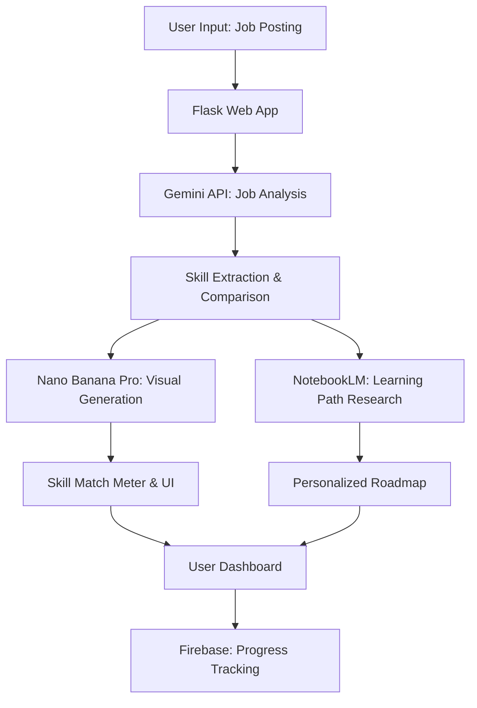

# Design Document: Skill Gap Analyzer

## Overview

The Skill Gap Analyzer is a prompt-based AI system that leverages Google AI Studio tools to analyze job postings, compare user skills, and generate personalized learning paths. The system uses a three-layer architecture: AI Analysis (Gemini API), Visual Generation (Nano Banana Pro), and Learning Research (NotebookLM), all orchestrated through a lightweight Flask application deployable to Google Cloud Run.

## Architecture

### High-Level Architecture



### Technology Stack

- **Frontend**: HTML5 + Tailwind CSS (responsive, mobile-first)
- **Backend**: Python Flask (lightweight, prompt-based architecture)
- **AI Services**: 
  - Gemini API (job parsing, skill analysis, matching logic)
  - Nano Banana Pro (visual skill meters, progress charts)
  - NotebookLM (learning path research, course recommendations)
- **Database**: Firebase Realtime Database (user profiles, progress tracking)
- **Deployment**: Google Cloud Run (containerized, auto-scaling)

## Components and Interfaces

### 1. Job Analysis Engine (Gemini API Integration)

**Purpose**: Parse job postings and extract structured skill requirements

**Key Functions**:
- `extract_job_skills(job_posting_text)`: Returns structured skill data
- `categorize_skills(skills_list)`: Groups skills by domain (frontend, backend, AI/ML)
- `estimate_skill_difficulty(skill_name)`: Returns learning time estimate

**Gemini Prompt Templates**:
```python
JOB_ANALYSIS_PROMPT = """
Analyze this job posting and extract:
1. Required technical skills (list each with proficiency level)
2. Preferred skills (nice-to-have)
3. Experience level required (junior/mid/senior)
4. Technology domains (frontend/backend/AI-ML/devops)
5. Salary range (if mentioned)

Job Posting: {job_text}

Return as structured JSON with confidence scores for each skill.
"""
```

### 2. Skill Comparison Engine

**Purpose**: Compare user skills against job requirements and calculate gaps

**Key Functions**:
- `calculate_confidence_score(user_skills, job_requirements)`: Returns 0-100% match
- `identify_skill_gaps(user_skills, job_requirements)`: Returns prioritized gap list
- `estimate_learning_time(missing_skills)`: Returns timeline for skill acquisition

**Gap Analysis Algorithm**:
```python
def calculate_skill_match(user_skills, job_skills):
    critical_skills = [s for s in job_skills if s.priority == "critical"]
    important_skills = [s for s in job_skills if s.priority == "important"]
    
    critical_match = sum(1 for s in critical_skills if s.name in user_skills) / len(critical_skills)
    important_match = sum(1 for s in important_skills if s.name in user_skills) / len(important_skills)
    
    confidence_score = (critical_match * 0.7) + (important_match * 0.3)
    return min(100, confidence_score * 100)
```

### 3. Visual Interface Generator (Nano Banana Pro Integration)

**Purpose**: Generate interactive visual elements for skill analysis display

**Key Components**:
- **Skill Match Meter**: Circular progress indicator (0-100%)
- **Skill Comparison Cards**: Side-by-side "Need vs Have" display
- **Learning Timeline**: Visual roadmap with milestones
- **Progress Tracker**: Real-time skill acquisition visualization

**Visual Generation Prompts**:
```python
SKILL_METER_PROMPT = """
Generate a circular skill match meter showing {confidence_score}% readiness.
Use color coding: Red (0-40%), Yellow (41-70%), Green (71-100%).
Include motivational text based on score range.
Style: Modern, mobile-friendly, India market appropriate colors.
"""
```

### 4. Learning Path Generator (NotebookLM Integration)

**Purpose**: Research and generate personalized learning roadmaps with real course links

**Key Functions**:
- `generate_learning_path(skill_gaps, user_profile)`: Creates structured roadmap
- `research_courses(skill_name, user_preferences)`: Finds relevant online courses
- `optimize_learning_sequence(skills_list)`: Orders skills by dependency and impact

**Learning Path Structure**:
```python
class LearningPath:
    def __init__(self):
        self.total_duration = 0  # days
        self.milestones = []     # weekly goals
        self.courses = []        # recommended courses
        self.confidence_projection = {}  # week -> confidence %
        
class Milestone:
    def __init__(self, skill, duration, courses, completion_criteria):
        self.skill = skill
        self.duration = duration  # days
        self.courses = courses    # list of course links
        self.completion_criteria = completion_criteria
```

### 5. Course Integration Service

**Purpose**: Integrate with online learning platforms and provide real course recommendations

**Supported Platforms**:
- Udemy (API integration for course search)
- Coursera (web scraping for course metadata)
- LinkedIn Learning (course link generation)
- YouTube (free tutorial playlists)

**Course Recommendation Algorithm**:
```python
def recommend_courses(skill_name, user_preferences):
    courses = []
    
    # Priority 1: Free courses (for India market)
    free_courses = search_free_courses(skill_name)
    courses.extend(free_courses[:2])
    
    # Priority 2: Paid courses with high ratings
    paid_courses = search_paid_courses(skill_name, max_price=user_preferences.budget)
    courses.extend(paid_courses[:3])
    
    # Priority 3: Language preference (English/Hindi)
    courses = filter_by_language(courses, user_preferences.language)
    
    return rank_by_relevance(courses, skill_name)
```

## Data Models

### User Profile
```python
class UserProfile:
    user_id: str
    name: str
    current_skills: List[Skill]
    learning_preferences: LearningPreferences
    career_goals: List[str]
    progress_history: List[ProgressEntry]
    
class Skill:
    name: str
    proficiency_level: int  # 1-10 scale
    last_updated: datetime
    verification_source: str  # "self-reported", "course-completed", "project-based"
    
class LearningPreferences:
    budget: int  # monthly budget in INR
    time_commitment: int  # hours per week
    learning_style: str  # "visual", "hands-on", "reading"
    language_preference: List[str]  # ["english", "hindi"]
```

### Job Analysis Result
```python
class JobAnalysis:
    job_id: str
    company_name: str
    position_title: str
    salary_range: SalaryRange
    required_skills: List[RequiredSkill]
    experience_level: str
    analysis_timestamp: datetime
    
class RequiredSkill:
    name: str
    priority: str  # "critical", "important", "optional"
    proficiency_required: int  # 1-10 scale
    learning_time_estimate: int  # days
    
class SalaryRange:
    min_salary: int
    max_salary: int
    currency: str = "INR"
```

### Skill Gap Analysis
```python
class SkillGapAnalysis:
    user_id: str
    job_id: str
    confidence_score: int  # 0-100%
    missing_skills: List[MissingSkill]
    learning_path: LearningPath
    estimated_readiness_date: datetime
    
class MissingSkill:
    skill_name: str
    impact_level: str  # "critical", "important", "optional"
    current_proficiency: int  # 0-10
    required_proficiency: int  # 1-10
    learning_time_days: int
    recommended_courses: List[Course]
```

Now I need to use the prework tool to analyze the acceptance criteria before writing the Correctness Properties section.

<function_calls>
<invoke name="prework">
<parameter name="featureName">skill-gap-analyzer

## Correctness Properties

*A property is a characteristic or behavior that should hold true across all valid executions of a system—essentially, a formal statement about what the system should do. Properties serve as the bridge between human-readable specifications and machine-verifiable correctness guarantees.*

After analyzing the acceptance criteria, I've identified several key properties that can be validated through property-based testing. These properties ensure the system behaves correctly across all possible inputs and scenarios.

### Property Reflection

Before defining the final properties, I reviewed all testable criteria from the prework analysis to eliminate redundancy:

- **Job parsing properties (1.1-1.5)** can be combined into comprehensive parsing validation
- **Skill comparison properties (2.1-2.5)** can be consolidated into core comparison logic
- **UI rendering properties (3.1-3.4)** can be grouped by component type
- **Learning path properties (4.1-4.5)** focus on roadmap generation consistency
- **Course recommendation properties (5.1-5.5)** ensure proper course metadata and ranking
- **Progress tracking properties (6.1-6.5)** validate state updates and user feedback

### Core Properties

**Property 1: Job Parsing Completeness**
*For any* valid job posting text containing skill requirements, the system should extract all mentioned technical skills and categorize them correctly by technology domain, with confidence scores reflecting extraction certainty.
**Validates: Requirements 1.1, 1.3, 1.4, 1.5**

**Property 2: Salary and Experience Extraction**
*For any* job posting containing salary ranges or experience requirements, the system should parse and store this information in structured format with proper validation of numeric ranges.
**Validates: Requirements 1.2, 1.4**

**Property 3: Confidence Score Bounds**
*For any* combination of user skills and job requirements, the calculated confidence score should always be between 0-100% and reflect the actual skill overlap percentage.
**Validates: Requirements 2.1**

**Property 4: Skill Gap Prioritization**
*For any* set of missing skills, the system should categorize them by impact level (Critical, Important, Optional) and prioritize them correctly based on job readiness impact.
**Validates: Requirements 2.2, 2.4**

**Property 5: Learning Time Estimation Consistency**
*For any* identified skill gap, the estimated learning time should be positive, realistic (between 1-90 days per skill), and consistent across similar skills.
**Validates: Requirements 2.3, 2.5**

**Property 6: Visual Component Rendering**
*For any* skill analysis result, the generated UI components should include a skill match meter with correct percentage, color-coded missing skills, and properly formatted time estimates.
**Validates: Requirements 3.1, 3.2, 3.3, 3.4**

**Property 7: Learning Path Structure**
*For any* set of skill gaps, the generated learning path should sequence skills by dependency order, provide realistic completion dates, and include 3-5 course recommendations per skill.
**Validates: Requirements 4.1, 4.2, 4.3, 4.4, 4.5**

**Property 8: Course Recommendation Quality**
*For any* skill requiring learning, the system should provide course recommendations with complete metadata (duration, rating, price), proper language prioritization (English/Hindi first), and highlight free alternatives when available.
**Validates: Requirements 5.1, 5.2, 5.3, 5.4, 5.5**

**Property 9: Progress Update Consistency**
*For any* learning milestone completion, the system should update skill proficiency levels, recalculate confidence scores, and reflect changes in the visual skill meter immediately.
**Validates: Requirements 6.1, 6.2, 6.4**

**Property 10: Motivational Feedback Triggers**
*For any* progress improvement or approaching deadline, the system should provide appropriate motivational messages and celebration feedback based on achievement level.
**Validates: Requirements 6.3, 6.5**

**Property 11: Data Persistence Across Sessions**
*For any* user switching between devices or sessions, their progress data, analysis results, and learning paths should be preserved and accessible.
**Validates: Requirements 7.3, 7.4**

**Property 12: Performance Bounds**
*For any* job posting analysis request, the system should complete processing within 10 seconds and handle API rate limiting gracefully with proper error messages.
**Validates: Requirements 8.1, 8.3**

**Property 13: Caching Effectiveness**
*For any* repeated visual generation or analysis request, the system should serve cached results when appropriate, improving response times for subsequent identical requests.
**Validates: Requirements 8.4**

## Error Handling

### API Integration Error Handling

**Gemini API Failures**:
- **Rate Limiting**: Implement exponential backoff with user-friendly "Analysis in progress" messages
- **Service Unavailable**: Fallback to cached analysis or simplified skill extraction
- **Invalid Response**: Retry with simplified prompts, graceful degradation to manual skill input

**NotebookLM Integration Failures**:
- **Research Timeout**: Provide generic learning paths based on skill difficulty templates
- **Course API Failures**: Fallback to curated course database with manual links
- **Content Generation Issues**: Use template-based roadmaps with user customization options

### Data Validation and Sanitization

**Input Validation**:
- Job posting text: Maximum 10,000 characters, sanitize HTML/scripts
- User skill input: Validate against known skill taxonomy, prevent injection
- Proficiency levels: Enforce 1-10 scale with proper bounds checking

**Output Validation**:
- Confidence scores: Always between 0-100%, handle edge cases (no skills match = 0%)
- Learning timelines: Ensure dates are in future, realistic duration bounds
- Course links: Validate URL format, check for broken links periodically

### User Experience Error Handling

**Progressive Degradation**:
- If AI services fail: Provide manual skill input forms with guided suggestions
- If visual generation fails: Fall back to text-based analysis with clear formatting
- If course integration fails: Display generic learning resources with manual search links

**Error Communication**:
- Clear, actionable error messages in English and Hindi
- Progress indicators during long-running AI operations
- Retry options with different analysis approaches

## Testing Strategy

### Dual Testing Approach

The system requires both **unit tests** and **property-based tests** to ensure comprehensive coverage:

- **Unit tests**: Verify specific examples, edge cases, and integration points
- **Property tests**: Verify universal properties across all possible inputs
- Together they provide complete validation: unit tests catch concrete bugs, property tests verify general correctness

### Property-Based Testing Configuration

**Testing Framework**: We'll use **Hypothesis** (Python) for property-based testing, configured with:
- Minimum 100 iterations per property test (due to randomization)
- Custom generators for job postings, skill sets, and user profiles
- Shrinking enabled to find minimal failing examples

**Test Tagging Format**: Each property test must include a comment referencing the design property:
```python
# Feature: skill-gap-analyzer, Property 1: Job Parsing Completeness
def test_job_parsing_completeness(job_posting_generator):
    # Test implementation
```

### Unit Testing Focus Areas

**Specific Examples and Edge Cases**:
- Empty job postings, malformed text, non-English content
- Users with no skills vs. users with all required skills
- Jobs requiring 0 experience vs. senior-level positions
- Free courses only vs. premium course preferences

**Integration Points**:
- Gemini API response parsing and error handling
- Firebase data persistence and retrieval
- Nano Banana Pro visual component generation
- NotebookLM learning path research integration

**Error Conditions**:
- API timeouts and rate limiting scenarios
- Invalid user input and malformed job postings
- Network connectivity issues and offline functionality
- Cache invalidation and data consistency

### Property Test Implementation Strategy

Each correctness property will be implemented as a single property-based test:

1. **Generate diverse test inputs** using custom generators
2. **Execute the system function** under test
3. **Assert the property holds** for all generated inputs
4. **Use shrinking** to find minimal counterexamples when tests fail

**Custom Generators**:
- `job_posting_generator`: Creates realistic job postings with varying formats
- `user_skill_generator`: Generates diverse user skill profiles
- `course_data_generator`: Creates course metadata for recommendation testing
- `progress_event_generator`: Simulates learning milestone completions

This comprehensive testing strategy ensures the Skill Gap Analyzer works correctly across all scenarios while maintaining the performance and user experience requirements for the India job market.